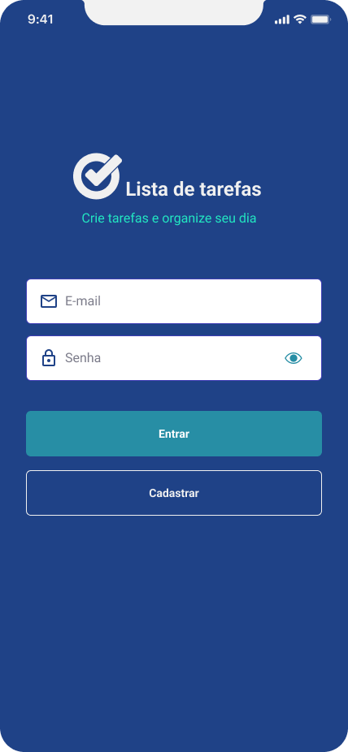
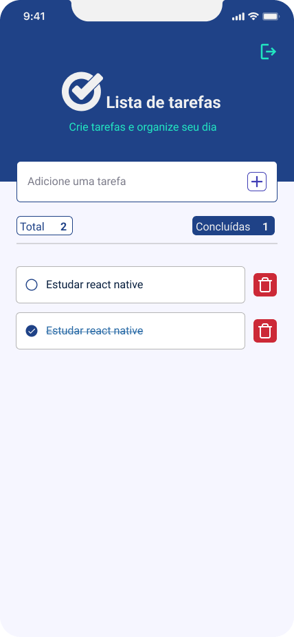

## 🔖 Projeto

Aplicativo de lista de tarefas com login. O usuário acessa a "Home" após realizar o cadastro, onde poderá incluir tarefas, removê-las e marcá-las como concluídas. O app guarda estado de acordo com o usuário logado. Foi desenvolvido como teste de seleção para uma vaga de desenvolvedor mobile.

### Requisitos

- Autenticação: Deverá ter autenticação utilizando Firebase Authentication. Deve eprmitir registro e login no app e após isso redirecionar para tela principal.

- Tela principal: Exibir lista de tarefas e permitir adicionar novas, marcar como concluídas e excluí-las. Ter botão de logout.

- Estilização: Utilizar Styled Components de forma coesa e responsiva.

- Gerenciamento de estado: Deve utilizar redux ou Context API para gerenciar estado global do aplicativo, autenticação e tarefas.

<br>

<p align="center">
  
  
<p>

<br>

## 🚀 Tecnologias

O projeto foi criado com o framework [Expo](https://docs.expo.dev/).

- React Native
- React Hooks
- Typescript
- Context API
- Styled Components
- Firebase Authentication

## 💻 Executando o projeto

Apesar do app ter sido desenvolvido em suas interfaces e funcionamento para ambas as plataformas (Android e iOS), a autenticação foi construída para rodar apenas no Android. Para executar, faça o clone do projeto, instale as dependências e depois rode o comando expo:

```bash
# executando o projeto usando npm
npm install
npx expo start

# Rodando no emulador do Android
npm run android
```

## 🚀 Observações

- O app guarda estados então se o usuário fechar o app e abrí-lo novamente, vai retornar para a última tela onde estava.

- O login vai funcionar apenas em dispositivos Android.

- Cada usuário logado tem acesso às suas tarefas.

- [Figma do projeto](https://www.figma.com/file/osRrXKeZXswiWPP4V8bPdy/To-do-list---App?type=design&node-id=0%3A1&mode=design&t=Vdf34RuD0xd96G58-1)